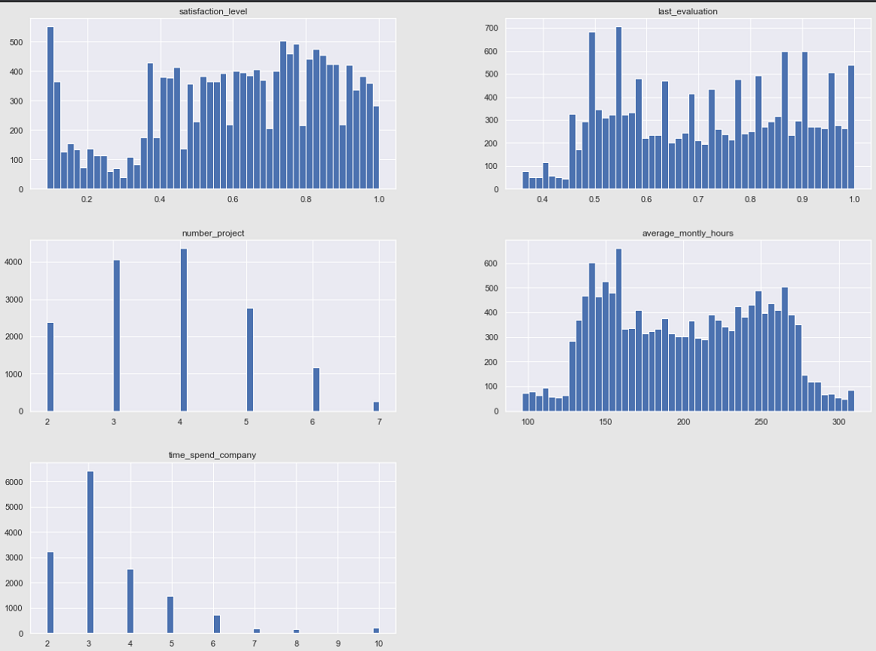
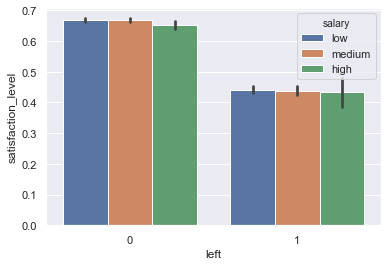
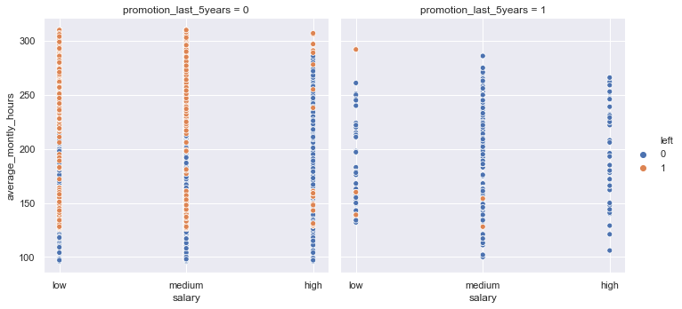

# Employee resignation prediction

# Summary
* Created a tool that predicts when an employee is going to resign in order to help perfect employee management and improve working space environment.
* Based on the public release data available on Kaggle, the features are employed.
* Engineered features to calculate dependencies of the target variable on the independent variables.
* Optimized Logistic, Random Forest, Decision Tree and Support vector classifier using GridSearchCV to reach best model.
* Achieved an accuracy of 95% in correctly predicting the outcome.
* Developed a public facing API for live user interaction using Streamlit imported as library.
* Deployed the Web App based on cloud application platform as a service through Heroku.

Getting to understand employees is a major task in any successful organization. Various factors combine enough to create a snowball effect in the minds of employee on whether he/she sees the future of oneself in their current working environment.

Some of the major factors include Salary, Satisfaction level, promotion, average working hours, etc… By correlating the different features we can arrive on a decision based on the prediction. Since the output here is whether the employee leaves or not therefore it is termed as a classification problem.

# Dataset

This dataset consists of 

  
Features

- Satisfaction Level
- Last Evaluation
- Number of Projects
- Average Monthly hours of work
- Time in the company
- Work_accidentleft
- Promotion in last 5 years
- Department
- Salary range

# Data Distribution

* Plotting the data points lets us understand the distribution
* Helps in deriving trends and draw conclusion
* Indicates the features that needs preprocessing

* Features like Satisfaction level, Monthly hours and Last evaluation shows normal distribution.
* The target variable 'Left' tells whether an employee is quitting or not.
* Value '1' indicated resignation whereas '0' implies employee is likely to stay.
* Before the preprocessing the data, the imbalance of the dataset needs to be handeled.

# Relationship of the target variable with independent variables

# Preprocessing

* It consisted of 3 major parts:
1. Handling class imbalance
* It is done using [SMOTE](https://www.geeksforgeeks.org/ml-handling-imbalanced-data-with-smote-and-near-miss-algorithm-in-python/)
2. Handling non numerical features
* Achieved with help of Dummy variables created with Pandas get_dummy function
3. Scaling the features
* Sklearn's preprocessing library contains Standard Scalar which scales the data points with help of mean and standard deviation of the data.

* A classification model attempts to draw some conclusion from observed values. Given one or more inputs a classification model will try to predict the value of one or more outcomes.
* Popular algorithms that can be used for binary classification include:

1. Logistic Regression
2. k-Nearest Neighbors
3. Decision Trees
4. Support Vector Machine
5. Naive Bayes

By employing the GridSearchCV on the above classifying algorithms we conclude-

SVC of support vector machine to be optimum with 95% accuracy

# User Interface

* Creating a user interface lets new users to visualize practical application of a machine learning model. 
* This WebApp is based on open source app framework called Streamlit.
* More about this framework [Here](https://streamlit.io/)
* Here is demo of the API

# Built with
<code></code>
<code></code>
<code></code>
<code></code>
<code></code>
